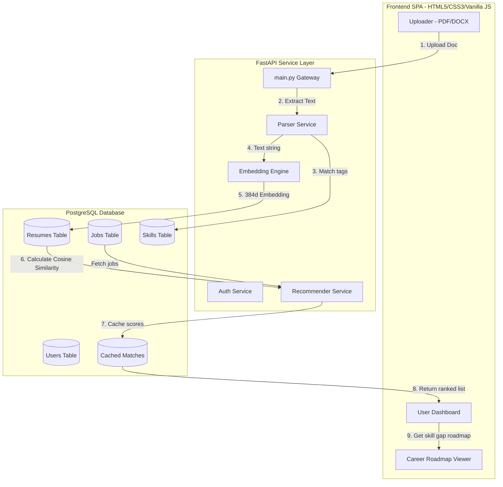

# AI-Powered Job Recommendation Platform

A production-ready job search and matching platform that connects candidate resumes to job postings using semantic vector similarity instead of simple keyword matching. The platform extracts skills, analyzes requirement gaps, and outlines a custom step-by-step career learning roadmap to help candidates qualify for their target roles.

---

## 1. Project Architecture

The system uses a **FastAPI** backend designed with a **Repository-Service pattern** and a **PostgreSQL** database. Semantic similarity is computed using the sentence-transformers model `all-MiniLM-L6-v2`. The frontend is a modern, responsive Single Page Application (SPA) designed with a glassmorphic aesthetic.



---

## 2. Key Features

* **JWT User Authentication**: Secure password encryption (bcrypt) and authorization headers for Candidate & Recruiter roles.
* **Resume Text Extraction**: Automatic PDF and Word doc extraction utilizing `pypdf` and `python-docx` structures.
* **Skill Extraction**: Word-boundary regex matching against a dictionary of technical skills.
* **Semantic Embeddings**: Leverages the `all-MiniLM-L6-v2` transformer model to convert text files into 384-dimensional vectors.
* **Cosine Similarity Ranking**: Real-time vector dot-product matching.
* **Skill Gap Analysis**: Compares candidate's skills against job vacancy tags to pinpoint exact missing competencies.
* **Career Roadmap Generator**: Generates custom project milestones and resources to help candidates build missing skills.
* **Recruiter CRUD Portal**: Management dashboard to post, review, edit, or delete job vacancies.

---

## 3. Folder Structure

```text
ai-job-recommendation-platform/
│
├── backend/
│   ├── app/
│   │   ├── api/                # FastAPI Routers (auth, jobs, resumes, recommendations)
│   │   │   └── deps.py         # Auth & role dependencies
│   │   ├── core/
│   │   │   └── config.py       # Pydantic Settings configuration
│   │   ├── database/
│   │   │   ├── base.py         # SQLAlchemy Base aggregation
│   │   │   ├── session.py      # Connection engine and session context
│   │   │   └── seed.py         # Database seeding script (skills & sample jobs)
│   │   ├── models/             # SQLAlchemy ORM schemas
│   │   ├── repositories/       # Abstraction layer for SQL queries
│   │   ├── schemas/            # Pydantic models for request/response validation
│   │   ├── services/           # Core business logic orchestrators
│   │   ├── ai/                 # AI & NLP Layer
│   │   │   ├── embeddings.py   # SentenceTransformer wrapper
│   │   │   ├── parser.py       # PDF/Word text parsing logic
│   │   │   ├── recommender.py  # Similarity ranking and skill gaps
│   │   │   └── skill_extractor.py # Regex skill matching engine
│   │   └── main.py             # FastAPI App definition & static serving mount
│   │
│   ├── tests/                  # Pytest unit & integration suites
│   ├── alembic/                # Database migrations schema environment
│   ├── alembic.ini             # Alembic configuration
│   ├── Dockerfile              # Multi-stage python image
│   └── requirements.txt        # Python dependency list
│
├── frontend/
│   ├── assets/
│   │   ├── css/
│   │   │   └── style.css       # Custom glassmorphic responsive styles
│   │   ├── js/
│   │   │   └── app.js          # Client SPA routers, auth hooks and AJAX uploads
│   ├── index.html              # Main single page container layout
│   └── README.md
│
├── docker-compose.yml          # Container configuration (Postgres + Backend)
├── README.md                   # Setup documentation
└── .gitignore                  # Git tracking exclusions
```

---

## 4. Virtual Environment & Local Installation

To run the application locally on your host machine without Docker:

### Windows:
```bash
# Create virtual environment
python -m venv venv

# Activate virtual environment
venv\Scripts\activate

# Install dependencies
pip install -r backend/requirements.txt
```

### Linux / Mac:
```bash
# Create virtual environment
python3 -m venv venv

# Activate virtual environment
source venv/bin/activate

# Install dependencies
pip install -r backend/requirements.txt
```

---

## 5. Local Database & Environment Configurations

1. Create a PostgreSQL database named `jobrec` locally.
2. Create a `.env` file inside the `backend/` directory (you can copy `.env.example`):
   ```ini
   PROJECT_NAME="AI-Powered Job Recommendation Platform"
   DATABASE_URL=postgresql://<username>:<password>@localhost:5432/jobrec
   SECRET_KEY=9a6c9dfdfc89e13a9609249767852debb081e7d23d8c1c4f5f5ff771a3962d3a
   ALGORITHM=HS256
   ACCESS_TOKEN_EXPIRE_MINUTES=120
   UPLOAD_DIR=uploads
   ```
3. Run the database seed script to verify tables and load initial data:
   ```bash
   # Make sure you are in the project root directory
   python -m backend.app.database.seed
   ```
4. Start the FastAPI development server:
   ```bash
   uvicorn backend.app.main:app --reload --port 8000
   ```
5. Open your browser and navigate to `http://localhost:8000/index.html`.

---

## 6. Docker-Compose Setup (Recommended)

Running the platform using Docker compiles and bundles all services with zero local host installations. 

1. Ensure **Docker Desktop** is installed and running on your system.
2. In the project root, run the build command:
   ```bash
   docker-compose up --build
   ```
3. The setup will automatically:
   * Build the backend image and download the SentenceTransformer model at build time.
   * Start a PostgreSQL container and verify db connections.
   * Run the seed script to create all schema tables and insert base vacancies.
   * Start serving the website at `http://localhost:8000`.

---

## 7. Running Pytests

To execute the unit and integration tests (Auth hashing, Resume text parsers, matching formulas) run:

```bash
# Execute within active virtual environment from project root
pytest backend/tests/ -v
```

---

## 8. API Documentation

Interactive OpenAPI/Swagger documentation is hosted at:
* **Interactive Swagger UI**: `http://localhost:8000/docs`
* **Alternative Redoc Documentation**: `http://localhost:8000/redoc`

### Primary Endpoints:
* `POST /api/auth/register`: Signup a candidate or recruiter account.
* `POST /api/auth/login`: Login with email and password, returns token.
* `GET /api/jobs/`: Fetch jobs list.
* `POST /api/jobs/`: Create a job vacancy. (Recruiters only).
* `POST /api/resumes/upload`: Upload PDF/DOCX file and generate matches. (Candidates only).
* `GET /api/recommendations/`: Get similarity matched vacancies and missing requirements.
* `GET /api/recommendations/{job_id}/roadmap`: Generate specific roadmap timeline.

---

## 9. Future Enhancements

1. **Vector Indexing (pgvector)**: Migrate standard `ARRAY` representations to indexing types like HNSW for large datasets.
2. **AI Mock Interviews**: Integrate an LLM agent to offer mock mock-question screens based on calculated missing skills.
3. **Automatic Application Sender**: One-click application pipeline forwarding parsed PDF resumes to recruiter contact emails.
