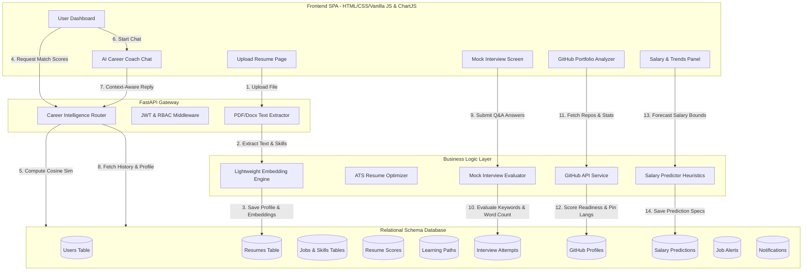

# FuturePath.AI - Enterprise AI Career Intelligence Platform

FuturePath.AI is a production-grade SaaS platform designed to transform traditional job search systems into an intelligent career development suite. By replacing simple keyword matching with local NLP models and vector similarity comparisons, FuturePath.AI provides candidates with semantic job matches, calculates precise job success probability scores, performs deep ATS resume optimization audits, runs mock AI interview screens, maps out personalized 4-week roadmaps, and analyzes developer portfolios directly from GitHub.

---

## 1. System Architecture

The platform is designed around a decoupled, highly scalable architecture utilizing the **Repository-Service pattern** and the **SOLID principles**:

- **Frontend**: A vanilla JavaScript Single Page Application (SPA) designed with a clean, light/dark mode, Stripe-like dashboard layout featuring collapsible navigations and Chart.js visuals.
- **Backend**: FastAPI providing async endpoint routers, rate limiting, Pydantic data validation, and custom exception bounds.
- **AI/NLP Layer**: Dynamic dual-mode embedding engine. It uses a 384-dimensional `all-MiniLM-L6-v2` transformer model for local calculation, and automatically falls back to an OOM-safe, CPU-native hash-based token similarity matcher in RAM-restricted hosting environments like Render's free tier (512MB RAM limits).
- **Database**: SQLAlchemy ORM natively supporting PostgreSQL (production) and SQLite (local development).

### 1.1 Architecture Flow Map



---

## 2. Advanced Feature Modules (15 Key Modules)

1. **AI Resume Optimizer**: Conducts deep structural analysis of uploaded resumes. Computes ATS, Readability, Formatting, Keyword Coverage, and Project Quality scores.
2. **Personalized Learning Path Generator**: Identifies missing competencies relative to target job postings and produces 4-week step-by-step roadmaps including resources, practice tasks, and mini-projects.
3. **AI Career Coach Chatbot**: A persistent conversational chatbot utilizing context from user resumes, job recommendations, and skill gaps to provide tailored career coaching.
4. **Job Success Probability Score**: Calculates a confidence score (0-100%) explaining why a candidate aligns with specific roles based on skill matching, experiences, and GitHub readiness.
5. **Project Recommendation Engine**: Recommends customized portfolio projects (Beginner, Intermediate, and Advanced) categorized by role (Backend, Frontend, DevOps, Machine Learning).
6. **AI Interview Preparation System**: Generates Technical, HR, Behavioral, and Coding questions at Easy, Medium, and Hard tiers. Scores completions and tracks performance trends.
7. **Resume vs Job Description Analyzer**: Compares resume texts directly against pasted job descriptions to check match rates, matched skills, and missing keywords.
8. **Skill Trend Analysis Dashboard**: Visualizes high-demand, fastest-growing, and highest-paying technical skills across active listings using Chart.js.
9. **Salary Prediction System**: Predicts minimum, average, and maximum salary estimations based on input experience, location, and skills with confidence parameters.
10. **Smart Job Alerts**: Offers user settings for notification frequencies (Daily, Weekly, Instant) and automatically sends alerts when new vacancies match candidate profiles.
11. **AI Skill Gap Simulator**: An interactive slider dashboard allowing candidates to select skills they intend to learn and simulate score boosts before taking courses.
12. **AI Career Path Predictor**: Forecasts 1, 3, and 5-year career timelines specifying target roles, required skills, and salary growth targets.
13. **GitHub Portfolio Analyzer**: Connects to the public GitHub API to extract repository sizes, commit counts, stars, languages, and calculate readiness indexes.
14. **Portfolio Quality Scorer**: Grades documentation completeness (README files), automated deployment scripts, and code quality.
15. **One-Click ATS Resume Generator**: Generates formatted, ATS-friendly resumes in DOCX and PDF layouts with customizable templates.

---

## 3. Database Schema

The database model consists of 17 tables configured with foreign key relations, cascade deletes, indexes, and custom JSON field mappings:

| Table Name | Description | Key Columns |
| :--- | :--- | :--- |
| `users` | User credentials and RBAC roles | `id`, `name`, `email`, `password_hash`, `role` |
| `resumes` | Candidate parsed text, file links, and embeddings | `id`, `user_id` (FK), `resume_text`, `resume_file`, `embedding` |
| `skills` | Central repository of skills | `id`, `skill_name` (Unique) |
| `resume_skills` | Association table between resumes and skills | `resume_id` (FK), `skill_id` (FK) |
| `jobs` | Job postings seeded or added by recruiters | `id`, `title`, `company`, `location`, `salary`, `description` |
| `job_skills` | Association table between jobs and skills | `job_id` (FK), `skill_id` (FK) |
| `recommendations` | Cached similarity scores for job matches | `id`, `user_id` (FK), `job_id` (FK), `match_score` |
| `resume_scores` | ATS optimization audits and metric breakdowns | `id`, `user_id` (FK), `ats_score`, `readability_score`, `suggestions` (JSON) |
| `learning_paths` | Structured roadmaps generated for target jobs | `id`, `user_id` (FK), `target_job`, `roadmap_data` (JSON) |
| `chat_sessions` | Career coach conversational session log histories | `id`, `user_id` (FK), `session_id` (Index), `history` (JSON) |
| `interview_attempts` | Completed mock Q&A screens and evaluations | `id`, `user_id` (FK), `category`, `difficulty`, `score`, `feedback` (JSON) |
| `github_profiles` | Extracted repo metrics and language ratios | `id`, `user_id` (FK), `username`, `profile_data` (JSON) |
| `portfolio_scores` | Portfolio quality scoring and improvements | `id`, `user_id` (FK), `score_data` (JSON) |
| `salary_predictions` | Estimated salary calculations based on parameters | `id`, `user_id` (FK), `skills`, `experience`, `min_salary`, `max_salary` |
| `notifications` | In-app smart alert notifications | `id`, `user_id` (FK), `title`, `message`, `is_read`, `type` |
| `job_alerts` | Configuration settings for match digests | `id`, `user_id` (FK), `frequency`, `preferences` (JSON) |
| `career_predictions` | Predicted 1-3-5 year career plan timelines | `id`, `user_id` (FK), `predictions_data` (JSON) |

---

## 4. Local Installation Guide

### 4.1 Prerequisites
- Python 3.10+
- SQLite (Local development) or PostgreSQL

### 4.2 Installation Commands

#### For Windows:
```powershell
# Clone the repository
git clone https://github.com/ogharsh-2025/FuturePath-AI.git
cd FuturePath-AI

# Create virtual environment
python -m venv venv
venv\Scripts\activate

# Install dependencies
pip install -r requirements.txt
```

#### For macOS / Linux:
```bash
# Clone the repository
git clone https://github.com/ogharsh-2025/FuturePath-AI.git
cd FuturePath-AI

# Create virtual environment
python3 -m venv venv
source venv/bin/activate

# Install dependencies
pip install -r requirements.txt
```

### 4.3 Environment Configurations
Create a `.env` file in the project root:
```ini
PROJECT_NAME="FuturePath.AI"
DATABASE_URL=sqlite:///./jobrec.db
SECRET_KEY=supersecretjwtkeyforlocaldevelopment12345
ALGORITHM=HS256
ACCESS_TOKEN_EXPIRE_MINUTES=120
UPLOAD_DIR=uploads
```

### 4.4 Programmatic Seeding & Dev Run
To initialize database tables, seed sample jobs, and start the development server:
```bash
# Start FastAPI (automatically handles metadata creation and seeding on startup)
uvicorn backend.app.main:app --reload --port 8000
```
Open `http://localhost:8000` in your web browser.

---

## 5. Docker Deployment (Containerization)

The project includes a multi-stage Docker build config for production deployments.

### 5.1 Docker Build & Run
Ensure Docker Desktop is active on your host system:
```bash
# Compile and run containers
docker-compose up --build
```
This commands provisions:
1. A **PostgreSQL database** container.
2. A **FastAPI backend** container that downloads the transformer model cache, sets up schemas, seeds base jobs, and mounts the static frontend.
3. Serves the unified SPA on `http://localhost:8000`.

---

## 6. Primary API Endpoints

Interactive Swagger UI documentation is hosted at `http://localhost:8000/docs`.

### 6.1 Authentication
- `POST /api/auth/register`: Create a new user account (Candidate or Recruiter).
- `POST /api/auth/login`: Authenticate and receive a JWT access token.
- `GET /api/auth/me`: Fetch current active session profile details.

### 6.2 Resumes & Match Recommendations
- `POST /api/resumes/upload`: Upload a PDF/DOCX resume file. Parses skills and calculates matching recommend scores.
- `GET /api/recommendations/`: Retrieve semantic vector matching job posts and missing skill lists.
- `GET /api/job-success-probability/{job_id}`: Returns success probabilities (0-100%) and reasons.

### 6.3 Career Intelligence
- `POST /api/resume-optimizer/analyze`: Audits resume ATS readability.
- `GET /api/resume-optimizer/generate-ats`: Downloads optimized resume as PDF/DOCX templates.
- `POST /api/resume-optimizer/analyze-jd`: Compares resume against a pasted job description.
- `POST /api/learning-paths/generate`: Generates 4-week roadmap schedules.
- `POST /api/career-coach/chat`: Persistent chatbot connection context.
- `POST /api/interview-prep/questions`: Fetch mock interview Q&As.
- `POST /api/interview-prep/submit`: Grade and submit answers.
- `POST /api/github-analyzer/analyze`: Fetches stats, languages, and readiness ratings.
- `POST /api/salary-prediction/predict`: Returns salary potential ranges.
- `GET /api/career-path-predictor`: Renders 1-3-5 year timelines.
- `GET /api/notifications`: Retrieves alerts log.

---

## 7. Automated Testing
To run the Pytest suites (includes testing on endpoints, JWT auth validation, resume text extraction, and cosine matching computations):
```bash
pytest backend/tests/ -v
```

---

## 8. License & Contributions
FuturePath.AI is open-source. Pull requests are welcome. Please read the Contributing guidelines for details on branching structures, SOLID patterns, and naming conventions.
